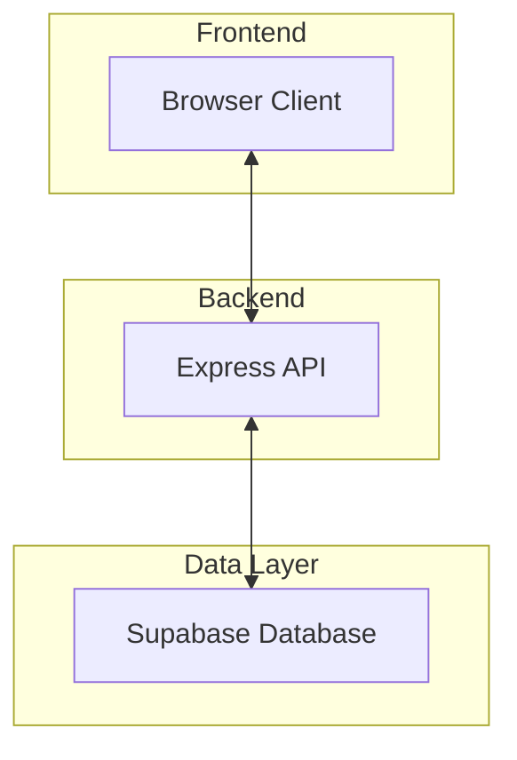
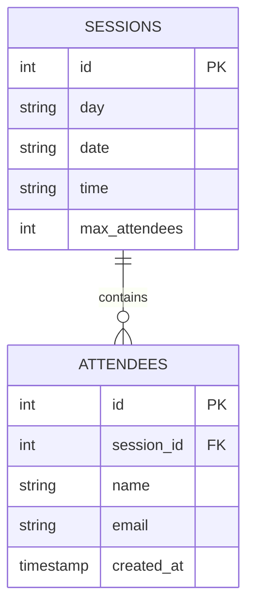

# System Patterns: MiniForum

## Architecture Overview

MiniForum follows a modern serverless architecture with a clear separation of concerns:

## Core Components

### 1. Client-Side Application
- Vanilla HTML/CSS/JavaScript frontend
- Single page interface for viewing sessions and registration
- Real-time display of available session capacity

### 2. Express API Server
- RESTful API endpoints for data operations
- Session retrieval endpoint (`/api/sessions`)
- Registration handling endpoint (`/api/signup`)
- Server-side validation for registrations

### 3. Supabase Database
- SQL database with relational model
- Session and attendee data storage
- Data integrity through constraints and relationships
- Custom view for efficient data retrieval

## Data Model

## Key Design Patterns

### 1. REST API Pattern
- Clear resource-based endpoints
- HTTP methods align with operations (GET, POST)
- Structured JSON responses
- Appropriate status codes for different scenarios

### 2. Data Validation Pattern
- Server-side validation for all inputs
- Email format validation
- Capacity checks before registration
- Duplicate registration prevention

### 3. View Pattern for Data Aggregation
- Custom database view (`sessions_with_counts`)
- Combines sessions with attendee counts
- Optimizes frontend data display

### 4. Error Handling Pattern
- Consistent error response format
- Detailed error logging
- Client-friendly error messages
- Different status codes for various error types

## Security Considerations

- Email uniqueness per session enforced at database level
- Input validation to prevent injection attacks
- Environment variables for sensitive configuration
- No exposure of sensitive attendee data to frontend
